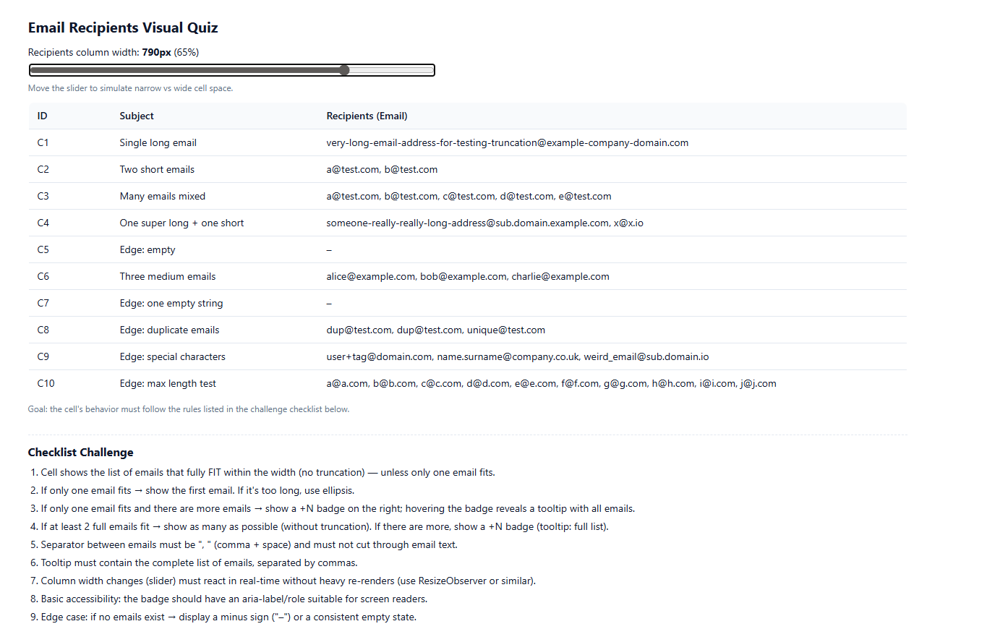
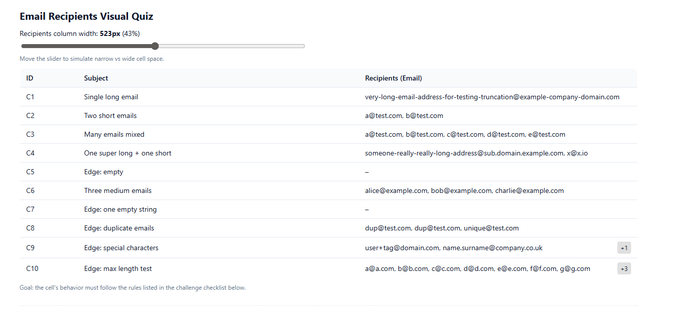
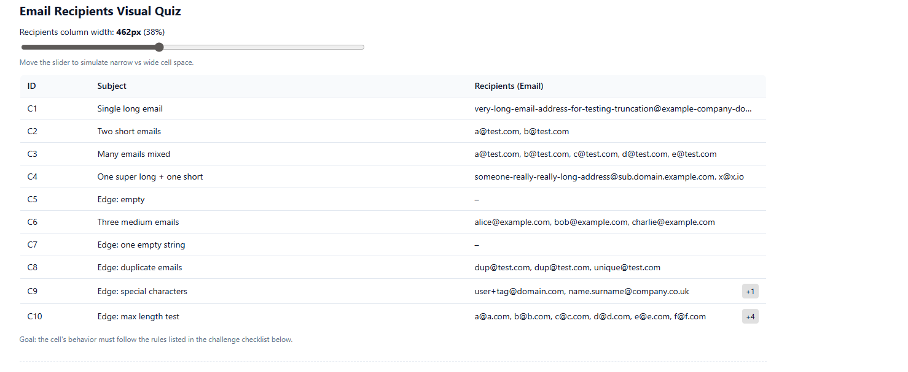
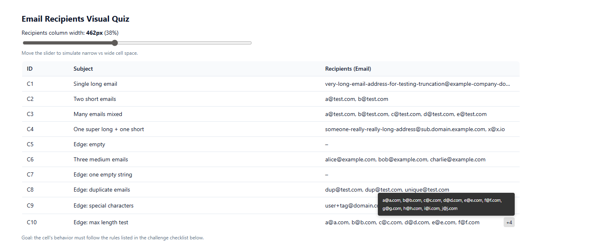

# Email Recipients Cell - Frontend Quiz Solution

A React component that intelligently displays email recipients in a table cell with dynamic width handling, truncation, and overflow badges.

## Challenge Overview

Create a responsive email cell component that:
- Shows as many complete emails as possible without truncation
- Handles narrow and wide cell widths gracefully
- Shows "+N" badge for overflow emails with tooltip
- Uses accurate text measurement (font-aware)
- Responds to real-time width changes

## Features Implemented

✅ Dynamic text measurement using Canvas API  
✅ Intelligent email fitting algorithm  
✅ Ellipsis truncation when only one email fits  
✅ "+N" overflow badge with hover tooltip  
✅ Real-time responsiveness with ResizeObserver  
✅ Accessibility support (aria-label, role, tabIndex)  
✅ Edge cases handled (empty array, empty string, duplicates)  
✅ No text truncation in middle of email addresses  

## How to Run Locally

### Prerequisites
- Node.js 18+ or 20+
- npm or yarn

### Installation & Setup

1. **Clone the repository**
   ```bash
   git clone <your-repo-url>
   cd email-recipients-cell
   ```

2. **Install dependencies**
   ```bash
   pnpm install
   # or
   yarn install
   ```

3. **Run development server**
   ```bash
   pnpm dev
   # or
   yarn dev
   ```

4. **Open in browser**
   ```
   http://localhost:5173
   ```
5. **Watch mode (development)**
    pnpm test

    # Run once (CI mode)
    pnpm test:run

    # With UI
    pnpm test:ui

    # With coverage report
    pnpm test:coverage

    The app will display an interactive quiz with 10 test cases. Use the slider to adjust the recipients column width and observe the component's behavior.

## Project Structure

```
├── src/
│   ├── components/
│   │   ├── EmailCell.tsx          # Main solution component
│   │   ├── EmailCell.test.tsx     # Main solution component test
│   │   ├── EmailCellQuiz.tsx      # Quiz component with test cases
│   │   └── quiz.css               # Styling
│   ├── App.tsx
│   └── main.tsx
├── package.json
├── tsconfig.json
├── vite.config.ts
└── README.md
```

## Component Usage

```typescript
import { EmailCell } from './components/EmailCell';

// Basic usage
<EmailCell emails={["user@example.com", "admin@test.com"]} />

// Empty state
<EmailCell emails={[]} />

// Single long email
<EmailCell emails={["very-long-email-address@example-company-domain.com"]} />
```

## Technical Implementation

### Text Measurement
- Uses Canvas API to measure actual text width with font metrics
- Accounts for font family, size, and weight
- More accurate than character counting

### Dynamic Fitting Algorithm
1. Measures available container width
2. Calculates width of each email + separators
3. Reserves space for "+N" badge if needed
4. Shows maximum emails that fit completely
5. Falls back to showing first email (truncated) if none fit

### Responsive Updates
- Uses `ResizeObserver` to detect width changes
- Recalculates visible emails on resize
- Minimal re-renders (only state updates when count changes)

## Checklist Compliance

All requirements from the challenge checklist are implemented:

1. ✅ Shows emails that fully fit (no mid-email truncation)
2. ✅ If only one fits → shows first with ellipsis
3. ✅ "+N" badge with tooltip when only one fits + more exist
4. ✅ Shows as many as possible when 2+ fit
5. ✅ Separator is ", " and doesn't cut through emails
6. ✅ Tooltip contains complete email list
7. ✅ Real-time response to width changes (ResizeObserver)
8. ✅ Accessibility features (aria-label, role, tabIndex)
9. ✅ Empty state displays "–"

## Screenshots

### Wide Column (shows all emails)
![Wide column view showing multiple emails] 

### Medium Column (partial list + badge)
![Medium column with +N badge] 

### Narrow Column (single email truncated)
![Narrow column with ellipsis] 

### Tooltip on Hover
![Tooltip showing all emails] 

## Test Cases Covered

The quiz includes 10 comprehensive test cases:

- **C1**: Single long email (tests truncation)
- **C2**: Two short emails (tests basic display)
- **C3**: Many emails mixed (tests overflow badge)
- **C4**: One super long + one short (tests mixed lengths)
- **C5**: Empty array (tests edge case)
- **C6**: Three medium emails (tests standard case)
- **C7**: Empty string (tests edge case)
- **C8**: Duplicate emails (tests duplicate handling)
- **C9**: Special characters (tests email format variety)
- **C10**: Max length test (tests many short emails)

## Technologies Used

- **React 18** with TypeScript
- **Vite** for build tooling
- **Canvas API** for text measurement
- **ResizeObserver API** for responsive updates
- **CSS-in-JS** with inline styles for dynamic styling

## Assumptions & Notes

1. **Font Consistency**: Assumes font settings are consistent across the component (uses computed styles from container)
2. **Badge Width**: Reserves ~40px for "+N" badge (handles up to "+999")
3. **Separator**: Always uses ", " (comma + space) as specified
4. **Empty State**: Shows "–" for both empty arrays and empty strings
5. **Tooltip Position**: Positioned above badge to avoid cutoff at bottom
6. **Browser Support**: Requires modern browsers with ResizeObserver support (Chrome 64+, Firefox 69+, Safari 13.1+)

## Live Demo

[View Live Demo](your-demo-url-here)

## Author

**Your Name**  
Email: your.email@example.com  
GitHub: [@yourusername](https://github.com/yourusername)

## License

This project is created as a solution for a frontend coding challenge.

---

**Challenge Completed**: ✅  
**All Requirements Met**: ✅  
**Ready for Review**: ✅